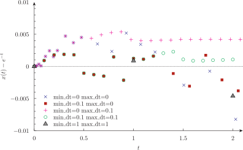

---
title: A simple differential equation
inputs: exp exp-dt
tags: PHASE_SPACE PRINT HEADER = .= end_time min_dt max_dt rel_error
...

-------

:::{.text-center}
[Previous](../003-lag) | [Index](../) | [Next](../005-lorenz)
:::


# A simple differential equation


The examples in this section show how a single ordinary differential equation can be solved with wasora. Indeed this is one of its main features, namely the ability to solve systems of differential-algebraic equations written as natural algebraic expressions. In particular, the equation the examples solve is

$$ \frac{dx}{dt} = -x $$


with the initial condition $x_0 = 1$, which has the trivial analytical solution $x(t) = e^{-t}$.


## exp.was

As clearly defined in wasora’s design basis, simple problems ought to be solved by means of simple inputs. Here is a solid example of this behavior.

```wasora
end_time = 1        # transient problem
PHASE_SPACE x       # DAE problem with one variable
x_0 = 1             # initial condition
x_dot .= -x         # differential equation
PRINT t x HEADER    # output
# exercise: plot dt vs t and see what happens
```

```bash
$ wasora exp.was | qdp -o exp --pi 1
$ 
```


By default, wasora adjusts the time step so an estimation of the relative numerical error is bounded within a range given by the variable `rel_error`, which has an educated guess by default. It can be seen in the figure that `dt` starts with small values and grows as the conditions allow it.

## exp-dt.was

The time steps wasora take can be limited by means of the special variables `min_dt` and `max_dt`. If they both are zero (as they are by default), wasora is free to choose `dt` as it considers appropriate. If `max_dt` is non-zero, `dt` will be bounded even if the conditions are such that bigger time steps would not introduce large errors. On the other hand, if `min_dt` is non-zero, the time step is guaranteed not to be smaller that the specified value. However, it should be noted that wasora may need to take several internal times step to keep the error bounded. In the limiting case where `min_dt = max_dt`, the time step can be set exactly although, again, wasora may take internal steps.

This situation is illustrated with the following input, which is run for five combinations of `min_dt` and `max_dt`.

```wasora
end_time = 2
min_dt = $1
max_dt = $2
rel_error = 1e-3
PHASE_SPACE x
x_0 = 1
x_dot .= -x
PRINT t x (x-exp(-t))/x
```

```bash
$ wasora exp-dt.was 0 0     > exp-dt1.dat
$ wasora exp-dt.was 0.1 0   > exp-dt2.dat
$ wasora exp-dt.was 0 0.1   > exp-dt3.dat
$ wasora exp-dt.was 0.1 0.1 > exp-dt4.dat
$ wasora exp-dt.was 1 1     > exp-dt5.dat
$ pyxplot exp-dt.ppl; pdf2svg exp-dt.pdf exp-dt.svg; rm -f exp-dt.pdf
$ pyxplot exp-error.ppl; pdf2svg exp-error.pdf exp-error.svg; rm -f exp-error.pdf
$ 
```





It can be seen that all the solutions coincide with the analytical expression. Even if the time step is set to a big fixed value, the error commited by the numerical solver with respect to the exact solution is the same as wasora iterates internally as needed. In general, the fastest condition is where `dt` is not bounded as wasora minimizes iterations by automatically adjusting its value. However, it is clear that controlling the time step can be useful some times. A further control can be obtained by means of the `TIME_PATH` keyword.


-------

:::{.text-center}
[Previous](../003-lag) | [Index](../) | [Next](../005-lorenz)
:::
