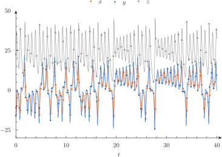

---
title: The Lorenz chaotic system
inputs: lorenz
tags: PHASE_SPACE CONST PRINT HEADER .= = 
...

-------

:::{.text-center}
[Previous](../004-exp) | [Index](../) | [Next](../006-fibonacci)
:::

# The Lorenz chaotic system


This example shows how to solve the chaotic [Lorenz’ dynamical system](http://en.wikipedia.org/wiki/Lorenz_system)---you know the one of the butterfly. The differential equations are

$$
\begin{cases}
\dot{x} &= \sigma \cdot (y - x)\\
\dot{y} &= x \cdot (r - z) - y\\
\dot{z} &= xy - bz\\
\end{cases}
$$

where $\sigma=10$, $b=8/3$ and $r=28$ are the classical parameters that generate the butterfly as presented by Edward Lorenz back in his seminal 1963 paper [Deterministic non-periodic flow](http://journals.ametsoc.org/doi/abs/10.1175/1520-0469%281963%29020%3C0130%3ADNF%3E2.0.CO%3B2).

## lorenz.was

Please note the beauty of both the Lorenz system and the associated wasora input.

```wasora
# lorenz' seminal dynamical system
PHASE_SPACE x y z
end_time = 40

# parameters
CONST sigma r b
sigma = 10
r = 28
b = 8/3

# initial conditions
x_0 = -11
y_0 = -16
z_0 = 22.5

# the dynamical system
x_dot .= sigma*(y - x)
y_dot .= x*(r - z) - y
z_dot .= x*y - b*z

PRINT t x y z HEADER

# exercise: play with the system! change
# the parameters and plot, plot plot!
```

```bash
$ wasora lorenz.was > lorenz.dat
$ qdp lorenz.dat -o lorenz2d --pt "16 17 18" --ps "0.5 0.5 0.5" --color "orange navyblue gray" --pi "60 71 87"
$ gnuplot lorenz3d.gp
$ 
```

The ability to solve the Lorenz system---that has both intrigued and inspired me since I was old enough to understand differential equations---with such simple and concise instructions shows me that indeed wasora has something to provide to the scientific/engineering community.





-------

:::{.text-center}
[Previous](../004-exp) | [Index](../) | [Next](../006-fibonacci)
:::
