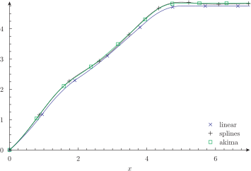
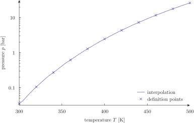
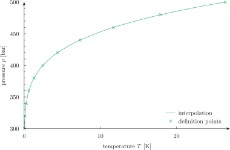

---
title: One-dimensional functions
inputs: algebraic inline file vectors satwater
tags: FUNCTION PRINT_FUNCTION MIN MAX STEP VAR FILE FILE_PATH VECTORS NUMBER OUTPUT_FILE INTERPOLATION cspline akima linear sin cos log sqrt derivative integral
...

-------

:::{.text-center}
[Previous](../006-fibonacci) | [Index](../) | [Next](../008-integrals)
:::


# One-dimensional functions


This example shows how functions can be defined and used in wasora.


## algebraic.was

Two algebraic functions $f(x)$ and $g(x)$ are defined and afterward printed and plotted using [qdp](https://github.com/seamplex/qdp), along with the integral of their product.

```wasora
# f(x) is an algebraic function of one variable
FUNCTION f(x) = sin(x)/log(1+x)
# the colon can be used as an alias to the FUNCTION keyword
g(x) := sqrt(cos(x)^2)

# these functions need an explicit range to be printed
# the PRINT_FUNCTION instruction can handle either the
# name of the function (i.e. without the argument) or an
# algebraic expression involving the same argument of
# the first function
VAR x'
a = 1
b = 5
PRINT_FUNCTION f g integral(f(x')*g(x'),x',1,x) MIN a MAX b STEP (b-a)/100
```

```bash
$ wasora algebraic.was > algebraic.dat
$ qdp algebraic.dat --xlabel "\$x\$" --ti "\$f(x)\$ \$g(x)\$ \$\\int_0^x{f(x')g(x')\,dx'}\$"
$ 
```


## inline.was

Now, another function called\ $f(x)$ is defined by a set of scattered points. By default, wasora interpolates the data with linear functions. If `PRINT_FUNCTION` does not get a range, it prints the definition points. Otherwise, the function is interpolated at the corresponding points. Finally,\ $f(x)$ can be evaluated at any value of\ $x$.

```wasora
# f(x) is point-wise defined
FUNCTION f(x) DATA {
0      1
1      1.5
2      0.75
3      1
4      1
5      0.1
6      0.1
7      0.1
}

# now PRINT_FUNCTION does not need a mandatory range
PRINT_FUNCTION f FILE_PATH inline-points.dat

# but if it is given, the function is interplated
# (by default as a linear piecewise function)
PRINT_FUNCTION f FILE_PATH inline-interp.dat MIN f_a MAX f_b STEP 1e-2

# we can also evaluate f(x) at arbitrary (x)
PRINT f(1.5)
PRINT f(3.5)
PRINT f(4.5)
```

```bash
$ wasora inline.was
1.125
1
0.55
$ pyxplot inline.ppl; pdf2svg inline.pdf inline.svg; rm -f inline.pdf
$ 
```


## file.was

This example shows three different methods of one-dimensional interpolation provided by wasora (indeed, by the [GNU Scientific Library](https://www.gnu.org/software/gsl/)). The data is read from a file, so the three functions use the same data set but are interpolated  in different ways. Recall that whenever a one-dimensional point-wise function called `f` is defined, three new variables are also defined:

 1. `f_a` contains the first point-wise value of the independent variable
 2. `f_b` contains the last point-wise value of the independent variable
 3. `f_n` contains the number of points of definition

```wasora
# f(x) is point-wise-defined linear piece-wise-interpolated
FUNCTION f(x) FILE_PATH function.data
# g(x) is point-wise-defined spline-interpolated
FUNCTION g(x) FILE_PATH function.data INTERPOLATION cspline
# h(x) is point-wise-defined akima-interpolated
FUNCTION h(x) FILE_PATH function.data INTERPOLATION akima

# we send all functions to the standard output
PRINT_FUNCTION f g h MIN f_a MAX f_b STEP 1e-2
```

```bash
$ cat function.data
0      1
1      1.5
2      0.75
3      1
4      1
5      0
6      0
7      0
$ wasora file.was > file.dat
$ qdp file.dat --ti "linear splines akima" --xlabel "\$x\$"
$ 
```


## vectors.was

The same data set is now used to define the same three functions $f(x)$, $g(x)$ and $h(x)$ as before but using vectors instead of files. The usage of the `derivative` and `integral` functionals to construct new functions of $x$ by means of an intermediate variable~$x'$ is ilustrated. Also, note that the size of the vector `datax` is defined as a constant `NUMBER`. Refer to the documentation of the `VECTOR` keyword for further information.


```wasora
VAR x'
N = 8

VECTOR datax SIZE N 
datax(i) = i-1

VECTOR datay SIZE N DATA 1 1.5 0.75 1 1 0 0 0

FUNCTION f(x) VECTORS datax datay
FUNCTION g(x) VECTORS datax datay INTERPOLATION cspline
FUNCTION h(x) VECTORS datax datay INTERPOLATION akima

f'(x) := derivative(f(x'), x', x)
g'(x) := derivative(g(x'), x', x)
h'(x) := derivative(h(x'), x', x)
F(x) := integral(f(x'), x', 0, x)
G(x) := integral(g(x'), x', 0, x)
H(x) := integral(h(x'), x', 0, x)

PRINT_FUNCTION f' g' h' MIN datax(1) MAX datax(N) STEP 1e-2 FILE_PATH derivatives.dat
PRINT_FUNCTION F  G  H  MIN f_a      MAX f_b      STEP 1e-2 FILE_PATH integrals.dat
```

```bash
$ wasora vectors.was
$ qdp derivatives.dat --ti "linear splines akima" --xlabel "\$x\$" --key "top"
$ qdp integrals.dat   --ti "linear splines akima" --xlabel "\$x\$" --key "bottom"
$ 
```





## satwater.was

This example builds functions of saturated water properties by reading a file, which can be freely downloaded from [NIST](http://webbook.nist.gov/chemistry/fluid/), containing several columns with data. The terminal shows the actual content of the file. The first two columns contain the saturation temperature and pressure, and the third one contains the liquid density. First, saturation pressure vs. temperature and the inverse saturation temperature vs. pressure functions are constructed. Also functions of the saturated liquid density as a function of the temperature and of the pressure are constructed by selecting the appropriate columns as the independent and dependent variable. Finally, the partial derivatives of the density with respect to temperature and pressure are defined as continuous functions, with the derivative functional acting on the akima-interpolated data set. Three out of the many possible curves are plotted in this example, giving the optional range to explicitly show how the interpolation works. The original points are also plotted for comparison. More columns could have also been retained from the original data set obtained from [NIST](http://webbook.nist.gov/chemistry/fluid/).

```wasora
VAR T' p'   # dummy variables for the derivative

FUNCTION psat(T) FILE_PATH satwater.txt COLUMNS 1 2 INTERPOLATION akima
FUNCTION Tsat(p) FILE_PATH satwater.txt COLUMNS 2 1 INTERPOLATION akima
FUNCTION rhoT(T) FILE_PATH satwater.txt COLUMNS 1 3 INTERPOLATION akima
FUNCTION rhop(p) FILE_PATH satwater.txt COLUMNS 2 3 INTERPOLATION akima

FUNCTION drho_dT(T) = derivative(rhoT(T'), T', T)
FUNCTION drho_dp(p) = derivative(rhop(p'), p', p)

PRINT_FUNCTION psat    MIN 300 MAX 500 STEP 2            FILE_PATH psat.dat
PRINT_FUNCTION Tsat    MIN 0.035368 MAX 26.392 STEP 0.02 FILE_PATH Tsat.dat
PRINT_FUNCTION drho_dT MIN 300 MAX 500 STEP 2            FILE_PATH drhodt.dat
```

```bash
$ wasora satwater.was
$ pyxplot satwater.ppl
$ pdf2svg drhodt.pdf drhodt.svg; rm -f drhodt.pdf
$ pdf2svg psat.pdf psat.svg; rm -f psat.pdf
$ pdf2svg Tsat.pdf Tsat.svg; rm -f Tsat.pdf
$ 
$ 
```






-------

:::{.text-center}
[Previous](../006-fibonacci) | [Index](../) | [Next](../008-integrals)
:::
