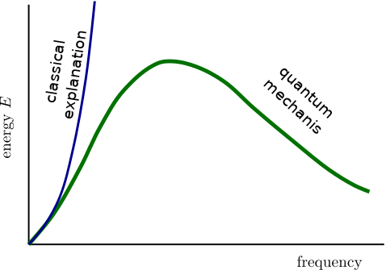
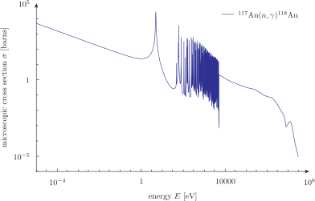
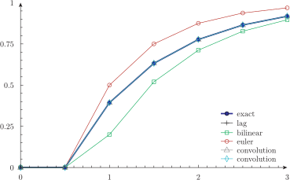
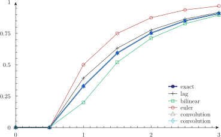
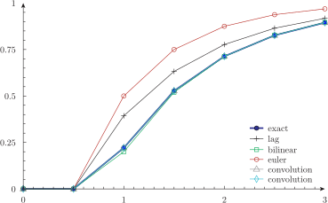
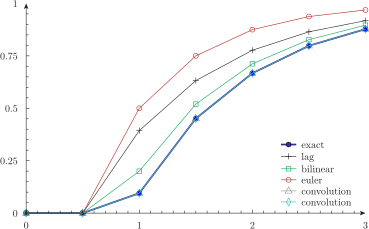

---
title: Fun with integrals
inputs: sigma resonance lag-comparison
tags: VAR PRINT TEXT integral gauss_kronrod gauss_legendre lag_bilinear lag_euler exp
...

# Fun with integrals

Who can have fun with integrals? Well, of course we nerds do. And, indeed, I get a lot of fun when nowadays I am faced to solving complicated integrals with numerical tools such as [wasora](https://www.saemplex.com/wasora) and compare the situation to the old days of undergraduate school when *integrals* meant *pencil and paper*. Poor me!


## sigma.was

The Stefan-Boltzmann constant used in every practical radiation heat transfer can be computed from other fundamental physical constants. Of course, you may think of the Stefan-Boltzmann constant as being a fundamental constant and of any other constant as depending on $\sigma$. The way you understand the universe is up to you. This example shows how you can compute it without having to resort to special mathematical tricks in order to analytically integrate a weird function---at the cost of recurring to wasora, of course.



The energy distribution of a black body radiation was proposed by Planck in his 1900 seminal paper. The power density of a black body irradiating energy of wavelenght $\lambda$ at an absolute temperature $T$ can be written as

$$ E(\lambda,T) = \frac{2 \pi h c^2}{\displaystyle \lambda^5 \left[\exp\left(\frac{hc}{\lambda k T}\right) - 1\right]} $$

where $h$ is Planck's constant, $c$ is the speed of light in vacuum and $k$ is Boltzmann's constant. The total power irradiated at temperature $T$ is thus

$$ E_b(T) = \int_0^{\infty} \frac{2 \pi h c^2}{\displaystyle \lambda^5 \left[ \exp\left( \frac{hc}{\lambda k T}\right) - 1 \right]} \, d\lambda $$

By defining a dummy variable $\xi$

$$ \xi = \frac{\lambda k T}{h c} $$

then (work out the math as an exercise)

$$ E_b(T) = \frac{2 \pi k^4}{h^3 c^2} \int_0^{\infty} \frac{1}{\xi^5 \left[\exp\left(\xi^{-1}\right) - 1\right]} \, d\xi \, \cdot \, T^4 = \sigma \cdot T^4 $$

from which an expression for the Stefan-Bolztmann constant $\sigma$ follows. An equivalent reasoning based on frequencies instead of wavelengths throws up a similar equation. The weird integral has an analytic solution in terms of $\pi$, but I am an engineer and I do not like elliptic integrals. To avoid overflows with the evaluation of the exponential in the integrand, the integration goes from $10^{-2}$ up to $\infty$. Compare the obtained results with what Google has to say about $\sigma$. 

```wasora
VAR xi   # dummy integration variable

h = 6.62606957e-34      # planck's contant [J s]
c = 299792458           # speed of light in vacuum [m s^(-1)]
k = 1.3806488e-23       # boltzmann constant  [m^2 kg s^(-2) K^(-1)]

# compute stefan-boltzmann constant
sigma = 2*pi*k^4/(h^3*c^2) * integral(1/(xi^5*(exp(1/xi)-1)), xi, 1e-2, infinite)

PRINT TEXT "sigma =" sigma TEXT "W m^(-2) K^(-4)"
```

```bash
$ wasora sigma.was
sigma =	1.32499e-43	W m^(-2) K^(-4)	
$ 
```

## resonance.was

The integral of resonance is an important parameter for computing nuclear reaction rates. It is defined as the integral over energy

$$ I_0 = \int_{E_c}^{E_0} \frac{\sigma(E)}{E} \, dE $$

where $\sigma(E)$ is the microscopic cross section of the reaction under consideration, $E_c$ is the epithermal cut-off energy (usually $E_c = 0.5 \text{eV}$) and $E_0$ is the maximum expected energy at which the reaction can occur.

The following example computes the integral of resonance for the reaction

$$ \,^{197}\text{Au} + n \rightarrow \,^{198}\text{Au} + \gamma $$

whose microscopic cross section dependence with the incident neutron energy can be obtained online from the ENDF VII library. One accepted result is

$$ I_0 = \left( 1550 \pm 28 \right) \text{barns} $$

which should be compared with the result $I_0 = 1570$ thrown by wasora almost instantaneously, even though there are more than forty thousand energies in the microscopic cross section data.

The microscopic cross section of the reaction $^{197}\text{Au}(n,\gamma)^{198}\text{Au}$ is read from text a file which was downloaded from the [Brookhaven National Laboratory webpage](http://www.nndc.bnl.gov). It is called `au117-ng-au118.dat` and contains two columns with the energy in eV in the first one and the cross section in barns in the second one. The terminal shows the actual number of lines present, although some of these lines correspond to text headers which are already commented using the hash character `#`, which wasora ignores perfectly well. The integral of resonance is computed by using the `integral` functional.


```wasora
# read XS vs energy from file
FUNCTION sigma(E) FILE_PATH au117-ng-au118.xs

E_c = 0.5       # cut-off energy in eV
E_max = 20e6    # maximum energy in eV

I = integral(sigma(E)/E, E, E_c, E_max)

PRINT TEXT " I = "  %.2lf I TEXT "barns" 
```

```bash
$ wc au117-ng-au118.xs
  42871   85743 1200389 au117-ng-au118.xs
$ head -n20 au117-ng-au118.xs
#ZVView-data-copy:  15-Feb-2007 19:40:08
#=======================================
#
#ENDF/B-VII.0: Au-197(N,G)AU-198
#X.axis: Incident Energy
#Y.axis: Cross Section
#wdata:  2
#ldata:  42859
#data...
#            X            Y
#           eV        barns
          1e-5      4916.77
    1.08465e-5      4721.01
    1.17567e-5      4534.58
    1.27342e-5      4357.07
    1.37826e-5      4188.08
    1.49493e-5      4021.34
    1.62038e-5      3862.54
     1.7551e-5      3711.33
     1.8996e-5      3567.39
$ tail au117-ng-au118.xs
        2.7e+7       1.6e-5
    2.72466e+7   1.52125e-5
    2.76207e+7   1.41033e-5
    2.81234e+7   1.27553e-5
    2.82467e+7   1.24356e-5
    2.86209e+7   1.15347e-5
        2.9e+7    1.0699e-5
    2.94958e+7   9.92123e-6
          3e+7   9.20006e-6
#-------------------------------------------------------------------------------
$ pyxplot resonance.ppl; pdf2svg au117-ng-au118.pdf au117-ng-au118.svg; rm -f au117-ng-au118.pdf
$ wasora resonance.was
 I = 	1570.61	barns	
$ 
```



## lag-comparison.was

This example shows different ways to compute first-order lags. One of them is computing the convolution integral of the impulsive response and the time history of the signal. It uses a deliberately big time step so the differences are evident. Besides comparing numerical results with the analytical solution of the lag of a step function, the invocation of wasora is performed in such a way that the value of the variable `t0` is read from the commandline using the construction `$1`. Therefore, wasora expects two arguments instead of one when invoked: the input and the value for `t0`. The terminal shows that wasora is executed from a Bash script for four different values of `t0`. Alternatively, the parametric mode of wasora could have been used, but we defer that kind of computation for further examples to come.


```wasora
VAR t'
end_time = 3
dt = 0.5
t0 = $1*dt
a = 1
tau = 1

# note that r is a function so it can be integrated
r(t) := a*heaviside(t-t0)

# exact solution
y1[t0:infinite] = a*(1-exp(-(t-t0)/tau))

# lags are operators applied to signals, but in this
# context r(t) acts as a signal and not as a function
y2 = lag(r(t), tau)
y3 = lag_bilinear(r(t), tau)
y4 = lag_euler(r(t), tau)

# convolution are operators over functions
g(t) := 1/tau*exp(-t/tau)
y5 = integral(r(t') * g(t-t'), t', 0, t) 
y6 = integral(r(t-t') * g(t'), t', 0, t)

PRINT t y1 y2 y3 y4 y5 y6 
```

```bash
$ cat loop.sh
for i in 1.0 1.2 1.5 1.8; do
 wasora lag-comparison.was $i | qdp -o comparison$i --plottitle "\$t_0 = $i \\cdot \\Delta t\$" --ti "exact lag bilinear euler convolution convolution" --key bottom --lw 3 --pt 31
done
$ ./loop.sh
$ 
```










-------
:::{.text-center}
[Previous](../007-functions) | [Index](../) | [Next](../010-2dfunctions)
:::
